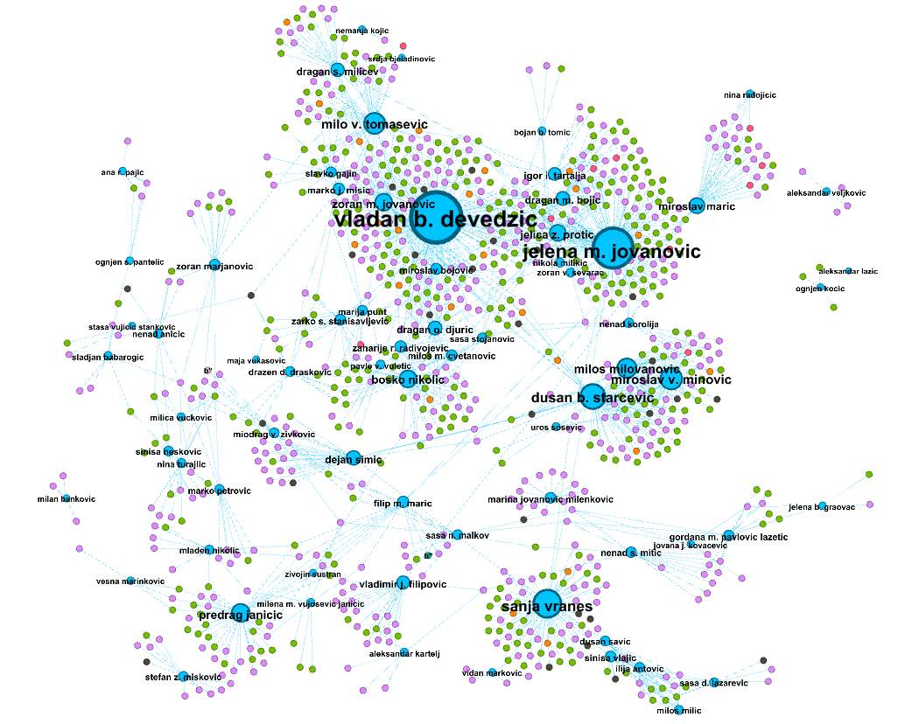
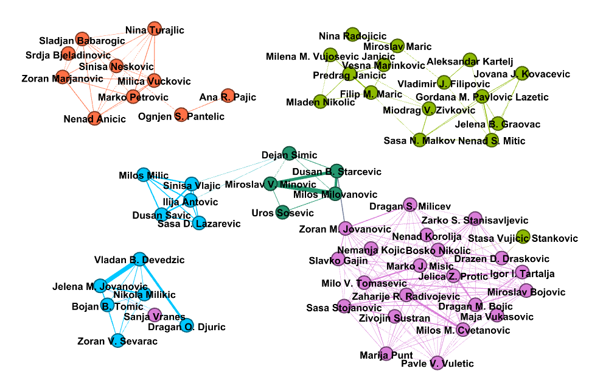
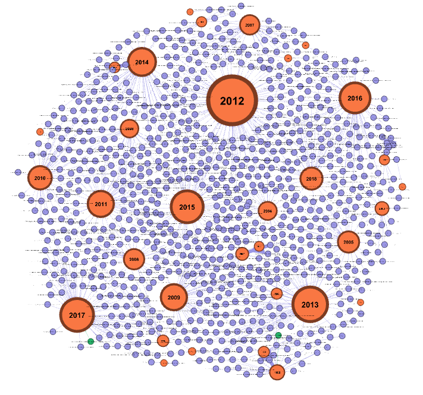
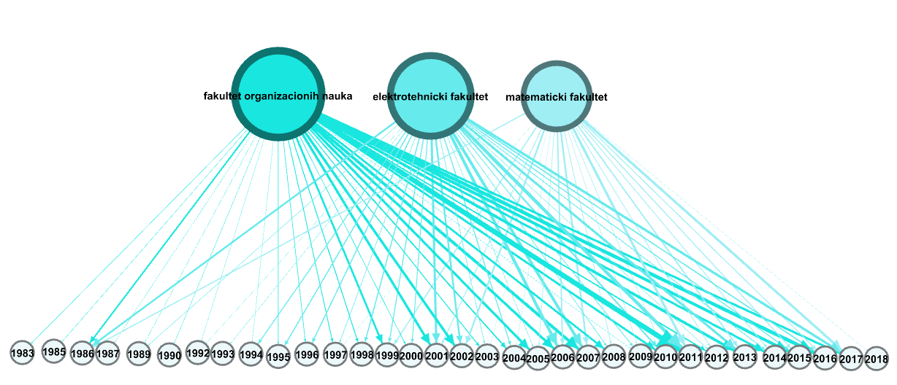
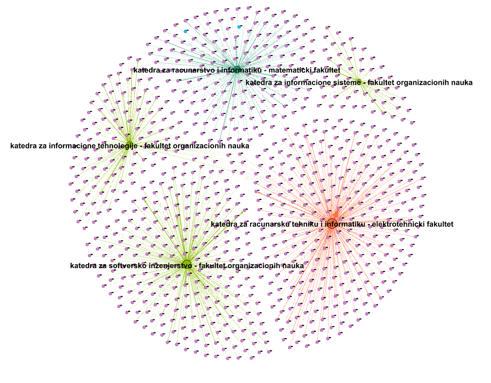

## Social Network Analysis of Computer Science research papers on University of Belgrade

### Introduction
This repositorium represents project work for analysis of Compute Science scientific publications on University of Belgrade. 

It is based on social network modeling, using different techniques and tools, calculating and understanding varius network metrics to conduct qualitative and quantitative analysis, bibliometric and scientometric analysis. The goal was to estimate and determine the level of collaboration in reseach comunity on University of Belgrade. For that purpse [Python 3.7](https://docs.python.org/3.7/ "Python 3.7") and [NetworkX](https://networkx.github.io/ "NetworkX") package were used and for visualization purposes, [Gephi](https://gephi.org/ "Gephi") tool was used.

Primary dataset was obtained from indexed database of scientific research paper [Scopus](https://www.scopus.com/home.uri "Scopus"). It contains 1290 research papers up until 2018. Analysis is based on research papers published in scientific articles and conferences. That dataset is imported, cleaned and  processed in python and represents a starting point for this research. The network analysis itself was done in Python and Gephi software. 

This research was done as project work on course in [Social Network Analysis ](https://www.etf.bg.ac.rs/en/fis/karton_predmeta/13M111ASM-2013 "Social Network Analysis ")  on Master's degree in Software Engineering.

### Examples
This are examples of various social networks created for research purposes. Network modeling was done in python (see project structure section and information on how to run python code).

- Network of professors and their published papers:

- Coauthor network - professors who worked together on publishing papers:

- Network of articles where research papers were published:

- Network of articles and reserch papers:

- Network of scientific productivity (research papers and years in which they were published):

- Faculties and years when their professors were publishing:

- Facutlies and deparments with research papers published by their professors:

### More Information
For more information on this topic please see documentation. It contains both the project specification and project report.

Project report contaings all of the information behind this research: visualization, metrics, results and conclusions.

### Project structure
In this repositorium you will find three directories:
- documentation - contains specification and project report.
- gephi - contains .gephi files that you can import and work with created networks in Gephi tool. They were created by importing two, previously exported files (node and edges files) that represent social network. Those files were created and exported in python.
- src - contains python source code for data analysis and network modeling and metrics.

In src directory you will find following things:
- dataset directory - contains two .xslx files (list of authors and list of research papers).
- output directory - for every created social network in this directory are outputed following thing:
-- .csv file representing network nodes (it can be used for further analysis eg in Gephi).
-- .csv file representing network edges (it can be used for further analysis eg in Gephi).
-- .txt file containg network metrics (calculated using NetworkX).
- social_networl_analysis directory - python package containing logic for importing, cleaning and processing dataset; creating, modeling, calculating metrics and exporting networks.
- main.py script - entry poing for execution. See next section on how to run python code.

### How to run code
This project was implemented in Python 3.7. Make sure you use the same python version. The complete list of python module modules can be found in requirements.txt file.

